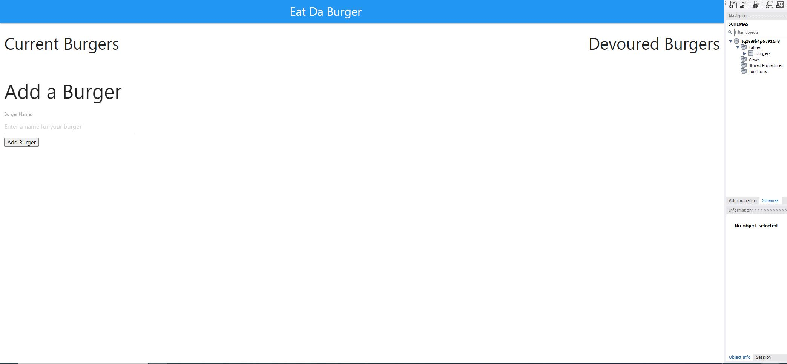

# EAT DA BURGER!

# Table of Contents

- [Installations](#Installations)
- [Usage](#Usage)
- [License](#License)
- [Credits](#Credits)
- [Test](#Test)
- [Contributing](#Contributing)
- [Screenshots](#Screenshots)

# Description

Eat Da Burger is a restaurant app that lets users input the names of burgers they would like to eat. When a user submits a burgers name it is displayed on the left of the screen. The user then clicks the "devour" button and the burger will move to the right side of the screen. It is made using the MVC design pattern, using an ORM with node JS, Express JS, Handlebars and the MySQL database.

# Installations

> node index.js locally, its deployed to heroku.

# Usage

Enter data as represented on the website or Install locally and run 'npm start' to run on a localhost.

# License

MIT

# Screenshots

.JPG>)
.JPG>)

# Credits

Tony Crosby

# Test

No test for this homework

# Contributing

By commiting early and often!!!! :)

&copy; 2020 Tony Crosby
